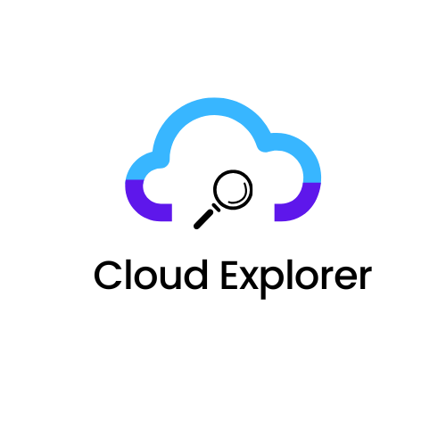

# Cloud Explorer



## Introduction

Cloud Explorer is a mobile application built using React Native designed to help users learn Google Cloud Platform (GCP) concepts through visually appealing informatics, engaging quizzes, and exams at the end of each certification journey, such as the Cloud Digital Leader Certification.

## System Architecture

### Application Architecture

- **Frontend**: React Native for building cross-platform mobile applications (iOS and Android).
- **Backend**: Node.js with Express.js for handling API requests.
- **State Management**: Redux for managing application state.
- **Navigation**: React Navigation for handling navigation within the app.
- **Authentication**: Firebase Authentication for user login and registration.

### Cloud Architecture

- **Compute**: Google Compute Engine for running backend services.
- **Storage**: Google Cloud Storage for storing user data and application assets.
- **Database**: Google Firestore for real-time database and data synchronization.
- **Authentication**: Firebase Authentication for secure user authentication.
- **CI/CD**: Google Cloud Build for continuous integration and deployment.
- **Hosting**: Google Cloud Run for deploying and managing containerized applications.

## Functional Requirements

1. **User Authentication**: Users should be able to register, log in, and log out.
2. **Dashboard**: Display an overview of the user's cloud resources and learning progress.
3. **Learning Modules**: Provide interactive learning modules for various GCP concepts.
4. **Quizzes**: Include quizzes to test users' understanding of the concepts.
5. **Exams**: Offer exams at the end of each certification journey.
6. **Progress Tracking**: Track and display users' progress through the learning modules.
7. **Notifications**: Send notifications about quiz and exam results, and learning milestones.
8. **Settings**: Allow users to configure app settings and preferences.

## Non-Functional Requirements

1. **Performance**: The app should load quickly and handle a large number of users efficiently.
2. **Scalability**: The backend should be able to scale to handle increasing user load.
3. **Security**: User data should be securely stored and transmitted.
4. **Usability**: The app should have an intuitive and user-friendly interface.
5. **Reliability**: The app should be highly available and handle failures gracefully.

## CI/CD Pipeline

1. **Version Control**: Use Git for version control and GitHub for repository hosting.
2. **Continuous Integration**:
   - **Trigger**: Set up a trigger in Google Cloud Build to start the pipeline on code push to the main branch.
   - **Build**: Dockerize the React Native app and backend services.
   - **Test**: Run unit tests and integration tests.
3. **Continuous Deployment**:
   - **Push to Container Registry**: Push the Docker images to Google Container Registry.
   - **Deploy to Cloud Run**: Deploy the containerized application to Google Cloud Run.
   - **Notifications**: Send notifications on build and deployment status via Google Chat or Slack.

### Example `cloudbuild.yaml` for CI/CD Pipeline

```yaml
steps:
  - name: 'gcr.io/cloud-builders/docker'
    args: ['build', '-t', 'gcr.io/$PROJECT_ID/frontend:$COMMIT_SHA', '.']
  - name: 'gcr.io/cloud-builders/docker'
    args: ['push', 'gcr.io/$PROJECT_ID/frontend:$COMMIT_SHA']
  - name: 'gcr.io/cloud-builders/gcloud'
    args: ['run', 'deploy', 'cloud-explorer', '--image', 'gcr.io/$PROJECT_ID/frontend:$COMMIT_SHA', '--platform=managed', '--region=us-central1']
```

## Getting Started

### Prerequisites

- Node.js and npm installed
- React Native CLI installed
- Google Cloud SDK installed and configured
- Firebase project set up

### Installation

1. Clone the repository:

   ```bash
   git clone https://github.com/yourusername/cloud-explorer.git
   cd cloud-explorer
   ```

2. Install dependencies:

   ```bash
   npm install
   ```

3. Set up Firebase:
   - Create a Firebase project and enable Authentication and Firestore.
   - Download the `google-services.json` file and place it in the `android/app` directory.
   - Download the `GoogleService-Info.plist` file and place it in the `ios` directory.

4. Start the development server:

   ```bash
   npm start
   ```

5. Run the app on an emulator or physical device:

   ```bash
   npm run android
   npm run ios
   ```

## Contributing

Contributions are welcome! Please read the contributing guidelines for more information.

## License

This project is licensed under the MIT License - see the LICENSE file for details.
